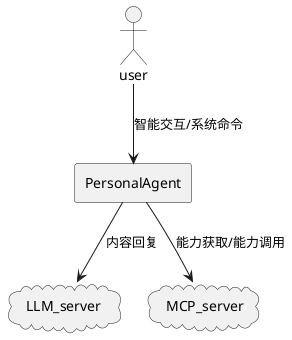
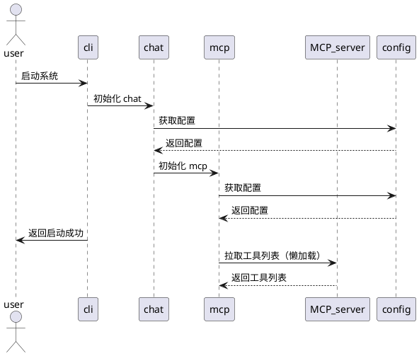
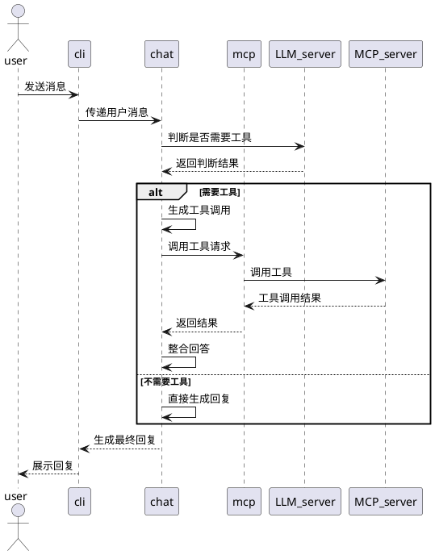
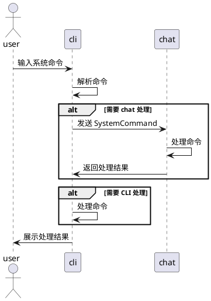
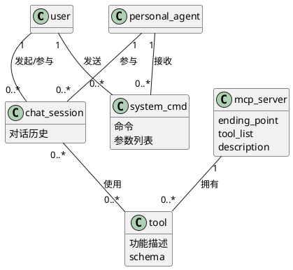

# personal-agent的总体设计

## 引言：文档结构介绍

>  <small><small> 系统总体设计文档上承系统目标，下接各项需求实现及子系统的详细设计。为此需要：
1. 定义系统的上下文，包括：系统本身、系统操作者、相关的周边系统，以及它们的互动关系；
2. 划分子系统，并明确定义各子系统的职责和主要服务；
3. 明确各子系统之间，以及子系统与周边系统之间如何协作以实现操作者的操作；
4. 识别并统一定义核心业务概念，包括各概念、概念的属性及概念之间的关系；
5. 定义关键的架构规则和约束
   
  </small></small> 

本文档描述了个性化智能助手(personal-agent)的总体设计。其目标是：
- 帮助阅读者快速了解系统的总体架构
- 指导后续各个需求的设计和实现方案的设计。

## 1. 系统上下文定义

>  ℹ️ <small><small> 本节将系统视为黑盒，精确定义：1）系统及其关联的实体，包括系统本身、系统操作者及相关周边系统；2）系统与操作者及周边系统的互动关系。本节为后续设计提供基准和指导，包括：1）统一系统、操作者、周边系统的命名；2）结合下节的子系统划分，指导实现需求的系统协作过程。</small></small> 

### 上下文和实体定义

- 待开发的系统
  - 系统 1：
    - 名称：个性化智能助理
    - 英文名称：personalAgent
    - 核心功能：为用户提供个性化的智能服务

- 系统的操作者
  - 操作者 1
    - 名称：用户
    - 英文名称：user
    - 目标：获得个性化智能服务

- 与系统相互作用的外部系统
  - 外部系统 1
    - 名称：LLM 服务器
    - 英文名称：LLM_Server
    - 主要服务：根据系统的内容请求生成回复
  -外部系统 2
    - 名称：mcp 服务器
    - 英文名称：MCP_Server
    - 主要服务：响应工具能力的查询；响应工具能力的调用

### 系统上下文图

## 2. 子系统划分和职责定义

>  ℹ️ <small><small> 本节将系统划分为子系统，并定义各子系统的职责及其对外提供的主要服务。用户操作通过这些子系统与外部系统之间的协作来实现。子系统应职责单一且明确，且子系统之间的边界应清晰。</small></small> 

- 子系统 1
  - 系统名称：cli
  - 中文名称：用户界面
  - 职责：用户交付的入口
  - 主要服务：接受并回复用户消息；接受并回复用户输入的命令

- 子系统 2
  - 系统名称：chat
  - 中文名称：对话管理
  - 职责：管理与用户的对话过程及对话历史
  - 主要服务：响应用户的对话请求；管理对话的历史

- 子系统 3
  - 系统名称：mcp
  - 中文名称：mcp 管理
  - 职责：管理 MCP 服务器及其提供的工具的使用
  - 主要服务：响应工具的调用请求；响应工具能力的查询；

- 子系统 4
  - 系统名称：config
  - 中文名称：配置管理
  - 职责：统一管理系统（包括子系统）的配置
  - 主要服务：响应各个模块的配置参数请求

## 3 关键场景的系统协作流程

>  ℹ️ <small><small>  本节描述关键业务场景下的系统协作流程，即各子系统与外部系统如何协作以响应并满足操作者的操作。协作仅发生在前文定义的操作者、子系统和外部系统之间。关键业务场景通常包括：1）系统启动场景；2）操作者的主要操作场景。通过关键场景的协作流程，验证：1）子系统划分的完备性，即通过子系统协作能否满足场景需求；2）子系统划分和职责分配的合理性，即各子系统职责是否明确且单一，边界是否清晰。</small></small> 

### 场景 1：系统启动

### 场景 2：用户对话

### 场景 3：用户发送系统命令

## 4. 概念定义和领域模型

>  ℹ️ <small><small>  本节定义核心业务概念，包括各概念、概念之间的关系及其关键属性。概念定义也称为领域模型或术语表，应作为业务（如需求描述）、产品（如需求细化）和技术（如设计与代码实现）等环节的共同语言，以提高沟通的效率和准确性。</small></small> 

- 用户（user）：系统的使用者
  - 关系：用户会对系统发起对话，产生一个对话；用户会对系统发送系统命令
- 系统（personal_agent）：用户使用的个性化智能体

- 系统命令（system_cmd）:
  - 属性：命令；参数列表
- 对话（chat_session）: 用户和系统（personal_agent）的一次对话过程。
  - 属性：对话历史
  - 关系：使用工具
- MCP服务器（mcp_server）: 遵循MCP标准协议的线上服务，它提供一个可用的工具列表。
  - 属性：连接端点（ending_point），工具列表(tool_list),服务描述（description）
  - 关系：拥有工具
- 工具（tool）: MCP 服务器所提供的工具列表中的一个工具实例，
  - 属性：功能描述；schema

下图表达这些概念和概念的关系。  

## 5. 关键架构约束

> ℹ️ <small><small> 本节描述系统架构设计过程中必须遵循的约束和指导原则，包括技术选型、子系统边界、外部依赖、安全性、配置与运维等方面。通过明确这些约束和原则，为后续详细设计、开发和运维提供统一的指导和边界，确保系统具备一致性、可扩展性和可维护性。</small></small> 

### 5.1 子系统与集成约束
- 所有子系统依赖均通过 dependency-injector 容器注册和获取，禁止直接实例化或硬编码依赖。
- 各模块的对外接口通过 __init__.py 统一暴露，外部仅允许 import 这些接口，禁止直接 import 内部实现类或函数。
- 依赖关系变更需同步更新依赖注入容器配置。
- 依赖约束通过 import-linter 工具在 CI 中自动检查，违规 import 视为构建失败
- 所有与外部系统（包括第三方服务和内部 RESTful 系统）交互必须通过 Adapter 层实现，禁止在业务代码中直接调用外部依赖。Adapter 必须通过依赖注入容器注册和获取，便于 mock、替换和测试，确保可维护性和可测试性。

### 5.3 配置、扩展与运维
- 所有可变参数必须通过统一的配置管理子系统（config）进行集中管理。
- 新增工具、外部服务等扩展能力时，不得影响现有子系统的稳定性。
- 需统一日志格式，记录关键操作、异常和外部依赖调用情况。
- 需集成监控和告警系统，及时发现和处理故障。

